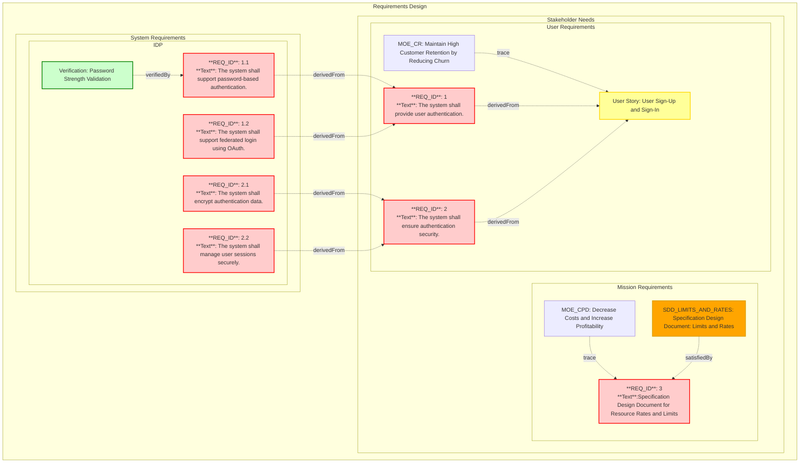

## Table of Contents
{:.no_toc}

* TOC
{:toc}

---

## Reqvire Modeling Language

---

Reqvire uses a lightweight modeling language based on **semi-structured Markdown**, inspired by SysML core concepts.

### Why Markdown Matters

By sticking to a semi-structured Markdown format:
- Models are inherently human-readable, serving as living documentation alongside your code
- Models can be used as-is by AI tools like ChatGPT, Claude, or local models

This makes Reqvire models powerful for both humans and **highly interoperable with AI systems**, whether embedded in CI/CD, editors, or code review bots.

### Model Structure

Each Reqvire model consists of:

- **Requirements** – User requirements and system requirements organized in a hierarchical structure through derivation relations
- **Verifications** – Test verifications, analysis verifications, inspection verifications, and demonstration verifications linked to requirements
- **Relations** – Explicit connections between elements including derivedFrom (requirement hierarchy), verifiedBy/verify (requirement-verification links), satisfiedBy (requirement-implementation links), refinedBy/refine (requirement-refinement links), and trace (soft traceability)
- **Files and Folders** – Organizational structure using Markdown files and folders to group related elements

Elements are defined using simple Markdown headers (`###`) with metadata and relations specified in subsections.

### Document Structure

#### Elements

An **Element** is a uniquely identifiable system element within a Markdown document. It starts with a `###` header and includes all content under that header until the next header of the same or higher hierarchy.

**Element names must be globally unique** across all files in your model. This ensures stable element identity when elements are moved between files.

**Element structure:**
1. Element Header (`###`) - Defines the start of an element
2. Element Content - Description and details
3. Subsections (`####`) - Metadata, Relations, Details

#### Metadata

Metadata is defined in a subsection with the header `#### Metadata` and contains properties as list items:

```markdown
#### Metadata
  * type: requirement
  * priority: high
```

**Reserved properties:**
- `type` - Defines the element type (requirement, user-requirement, verification, etc.)

#### Relations

Relations are defined in a subsection with the header `#### Relations` and contain links to related elements:

```markdown
#### Relations
  * derivedFrom: [Parent Requirement](file.md#parent-requirement)
  * verifiedBy: [Test Verification](verifications.md#test-name)
  * satisfiedBy: src/implementation.rs
  * refinedBy: [Rate Limit Constraint](constraints.md#rate-limit-constraint)
```

**Supported relation types:**

| Relation | Direction | Description |
|----------|-----------|-------------|
| `derivedFrom` | Child → Parent | Requirement hierarchy (child derives from parent) |
| `verifiedBy` | Requirement → Verification | Links requirement to its verifications |
| `verify` | Verification → Requirement | Links verification to requirements it verifies |
| `satisfiedBy` | Requirement → Implementation | Links to code files and test implementations that satisfy the requirement |
| `refinedBy` | Requirement → Refinement | Links requirement to its refinement elements (specification, constraint, behavior) establishing ownership |
| `refine` | Refinement → Requirement | Links refinement element back to its owning requirement (auto-generated from refinedBy) |
| `trace` | Element → Element | Soft traceability link between elements |

#### Attachments

Attachments are defined in a subsection with the header `#### Attachments` and contain references to supporting files or Refinement elements:

```markdown
#### Attachments
  * [Design Document](docs/design.md)
  * [Constraint Definition](constraints.md#memory-constraint)
```

**Supported attachment targets:**
- **File paths** - References to files (design documents, images, PDFs, etc.)
- **Refinement element identifiers** - References to Refinement elements (constraint, behavior, specification)

**Attachment scope constraints for Refinement elements:**
1. **Satisfied Refinement Constraint** - Refinements must have a `refine` relation (establishing an owner requirement via `refinedBy`) before they can be attached
2. **Hierarchical Independence Constraint** - Attachments are only allowed from requirements **outside** the owner's derivation hierarchy

These constraints ensure that:
- The owner requirement uses `refinedBy` to define ownership
- Requirements in the same hierarchy access refinements through the hierarchy relationship
- Cross-hierarchy attachments enable requirements from separate branches to reference shared specifications

### Element Types

Element types are identified through the `type` metadata property:

**Requirement Types:**
- **requirement** - System requirement
- **user-requirement** - User requirement

**Verification Types:**
- **verification** / **test-verification** - Verification through testing
- **analysis-verification** - Verification through analysis
- **inspection-verification** - Verification through inspection
- **demonstration-verification** - Verification through demonstration

**Refinement Types:**
- **constraint** - Design or implementation constraint
- **behavior** - Behavioral specification or state machine
- **specification** - Detailed specification document

Refinement elements are special elements that **can only have `refine` relations** pointing to requirements. They are used to provide additional detail and can be attached to requirements via the Attachments subsection. **Refinement elements cannot have their own Attachments subsection** - they are atomic documentation units meant to be attached to requirements, not to have attachments themselves.

### Type Determination

If no explicit type is specified, Reqvire uses intelligent defaults:
- Files in `Verifications/` directories default to `verification`
- Other files default to `requirement`

### File Header Requirement

Reqvire supports two model file formats. A model file must begin with one of these first level-1 headings:
- `# Elements` for multi-element files
- `# Documents` for single-element document files

Files without a supported first heading are ignored during model parsing.

```markdown
# Elements

### My Requirement
...
```

```markdown
# Documents

## Metadata
  * type: specification

## Relations
  * refine: [Some Requirement](Requirements.md#some-requirement)

## MyDocumentElement
Any markdown content is allowed here.
```

### Example Document

```markdown
# Elements

### User Login

The system shall provide secure user authentication using username and password.

#### Metadata
  * type: user-requirement

#### Relations
  * verifiedBy: [Login Test](../tests/auth.md#login-test)

#### Details

- Passwords must be hashed using bcrypt
- Failed login attempts shall be logged
- Account lockout after 5 failed attempts

---

### Password Validation

The system shall validate password complexity before accepting registration.

#### Metadata
  * type: requirement

#### Relations
  * derivedFrom: [User Login](#user-login)
  * verifiedBy: [Password Validation Test](../tests/auth.md#password-test)
  * satisfiedBy: src/auth/password.rs

---
```

### Organizational Approaches

Reqvire supports flexible organization:

**Separate repositories:**
```
requirements/
  └── Requirements.md
src/
  └── implementation.rs
```

**Co-located with code:**
```
src/
  ├── authentication/
  │   ├── Requirements.md
  │   └── auth.rs
```

**Mixed approach:**
```
requirements/          # High-level requirements
  └── UserRequirements.md
src/
  ├── module/
  │   ├── Requirements.md  # Detailed requirements
  │   └── implementation.rs
```

The co-location approach provides additional benefits for developers and AI coding assistants by placing requirements directly alongside the code they describe.

---

## Requirements

### Conceptual Overview

Reqvire is a tool, framework, and methodology for requirements management. In Reqvire, a **requirement** represents a stakeholder's need, system capability, or constraint that the system must fulfill. Requirements define:

- **What** the system must do
- **How** the system does it (including functional implementation details and non-functional aspects such as performance, security, and quality attributes)

These requirements serve as the foundation for system design, development, and verification.

Reqvire enforces a **consistent structure** for organizing and presenting requirements across the project. However, it does **not impose a specific syntax** for how the content of requirements is written. This provides flexibility for teams to tailor requirement expressions based on project context.

The use of structured syntaxes like **EARS (Easy Approach to Requirements Syntax)** is encouraged to enhance clarity and consistency but is **not mandatory**.

For detailed specifications on document structure and formatting, refer to: [Specifications](https://github.com/reqvire-org/reqvire/blob/main/requirements/SpecificationsRequirements.md).

### Requirement Types and Classification

Reqvire organizes requirements into **two main categories**:

- **User Requirements**
  (includes Stakeholder Needs, Mission Requirements, User Stories, and other WHAT-focused requirements)

- **System Requirements**
  (detailed technical and functional specifications describing HOW the system will fulfill user needs)

This structure supports a **progressive refinement** approach, ensuring traceability from high-level stakeholder expectations down to technical implementation.

### User Requirements

**User requirements** represent **stakeholder needs**, **mission objectives**, **user expectations**, and **WHAT-focused requirements**. These describe *what* the system must do from an external point of view, without specifying technical implementation details.

User requirements include:

- **Stakeholder needs**: High-level expressions of expectations from users, customers, operators, and regulatory bodies.
- **Mission requirements**: Enterprise-level objectives the system must support.
- **User stories**: Informal narratives that describe system interactions or functionalities from a user's perspective.
- **WHAT-focused requirements**: Formalized requirements that define system capabilities, behaviors, or constraints without dictating the solution approach.

User requirements serve as the **foundation for system design**, ensuring that all stakeholder concerns and operational goals are captured before technical development begins.

### System Requirements

**System requirements** specify **HOW** the system will fulfill the user and mission requirements. They define detailed **technical** and **functional** specifications, covering:

- System behaviors
- Performance criteria
- Interfaces and data flows
- Design and regulatory constraints

System requirements are derived from user requirements and are structured to map directly to **subsystems** or **components** of the overall system, ensuring **modularity** and **traceability**.

### Requirement Containment

Reqvire manages **requirement containment** through its **file and folder structure** rather than explicit containment relationships. This approach provides a natural and intuitive way to organize and group related requirements.

#### Files and Folders as Containers

In Reqvire, requirements are organized hierarchically using:

- **Folders**: Directory structure represents major system areas, subsystems, or requirement categories.
- **Files**: Markdown files serve as containers for requirements, typically grouping related requirements within a folder.

This file-and-folder based containment approach offers several advantages:

- **Natural hierarchy**: The directory structure directly reflects the containment relationships.
- **Simplified management**: No need to maintain explicit containment links between requirements.
- **Clear organization**: The physical location of a requirement in the documentation hierarchy shows its containment.
- **Flexible grouping**: Requirements can be easily reorganized by moving them between files or folders.

#### Example Structure

```
project/
├── Requirements.md              # Top-level user requirements
│   ├── REQ_AUTH
│   └── REQ_SECURITY
└── Authentication/
    ├── PasswordAuth.md          # Password authentication requirements
    │   └── REQ_PASSWORD
    └── OAuthAuth.md             # OAuth authentication requirements
        └── REQ_OAUTH
```

In this example:
- Top-level `Requirements.md` file contains high-level user requirements
- `Authentication/` folder contains detailed system requirements for the authentication subsystem
- Each file groups related requirements
- The `derivedFrom` relationship traces technical requirements back to user requirements
- Organization follows **architectural decomposition** by subsystem/component rather than by artifact type

### Diagram Summary

The diagram below demonstrates how requirements, their relationships, and hierarchical structures are organized within the **Reqvire methodology**.
It showcases the connection between stakeholder needs, user requirements, mission requirements, system requirements, and their links to verifications, specification documents, and other system elements.



### Visual Representation

Reqvire automatically generates visual representations of requirements and their relationships using Mermaid diagrams. For more information on diagrams, see the [User Guide](./user_guide.md#diagrams) and [Specifications](https://github.com/reqvire-org/reqvire/blob/main/requirements/SpecificationsRequirements.md).

---

## Verifications

### Conceptual Overview

In Reqvire, **verification** is the process of confirming that a system or its components meet specified **requirements**. Verification ensures that the system has been **built right**, checking whether it conforms to the defined functional and non-functional requirements at each level of system decomposition.

Verification activities are integrated into the **requirements structure**, maintaining clear **traceability** between requirements and their associated **verification methods** and **test artifacts**.

### Verification Element Types

Reqvire supports several verification element types that align with standard systems engineering verification methods:

#### Primary Verification Types
- **verification** - Default verification through testing (equivalent to test-verification)
- **test-verification** - Formal testing with documented test procedures and expected outcomes
- **analysis-verification** - Verification through systematic analysis of documentation or code without physical testing
- **inspection-verification** - Verification through formal examination of documentation, code, or physical components
- **demonstration-verification** - Verification through showing functionality in an operational-like environment

#### Relation Requirements by Verification Type
- **test-verification**: MUST have `satisfiedBy` relations pointing to actual test implementations
- **analysis-verification, inspection-verification, demonstration-verification**: Do NOT require `satisfiedBy` relations (considered satisfied by default)
- **trace relations**: Always allowed for any verification type

### Coverage Philosophy

Reqvire uses a **Verification Roll-up approach**, where verification of detailed requirements provides coverage for their parent requirements through the requirements hierarchy.

#### Leaf Requirements Focus

Reqvire's verification coverage focuses on **leaf requirements** - requirements that do not have forward relations to other requirements. These represent the actual testable functionality.

**Preferable Verification Approach:**

The recommended strategy is to **verify leaf requirements** rather than intermediate or parent requirements. This approach provides several key advantages:

- **Verification Roll-up**: When leaf requirements are verified, their verification status automatically rolls up through the traceability chain to cover all parent requirements up to the root
- **Efficiency**: A single verification can verify multiple leaf requirements, providing coverage for entire requirement chains
- **Coverage Completeness**: Verifying the most detailed, specific requirements ensures that all higher-level requirements they derive from are implicitly verified
- **Clear Test Scope**: Leaf requirements represent concrete, testable functionality with well-defined acceptance criteria

**Coverage Rules:**
- **Leaf requirements** MUST be verified - these represent the actual testable functionality
- **Parent/intermediate requirements** MAY be verified but it's not necessary as they are covered through verification of their leaf requirements
- One verification may verify multiple leaf requirements (N:1 relationship), covering entire chains of parent requirements

#### Coverage Metrics
The verification coverage system tracks:
- **Verified leaf requirements**: Leaf requirements with `verifiedBy` relations pointing to verification elements
- **Satisfied test-verifications**: Test-verification elements with `satisfiedBy` relations pointing to actual test implementations
- **Unsatisfied test-verifications**: Test-verification elements missing `satisfiedBy` relations (flagged as incomplete)
- **Coverage percentages**: Calculated separately for leaf requirements verification and test-verification satisfaction

### Two-Level Verification System

Reqvire implements a two-level verification approach:

1. **Requirements → Verifications**: Requirements link to verification elements via `verifiedBy` relations
2. **Test-Verifications → Test Implementations**: Test-verification elements link to actual test scripts/artifacts via `satisfiedBy` relations

```markdown
### My Requirement
The system shall process data within 500ms.

#### Relations
  * verifiedBy: [Performance Test](tests/PerformanceTests.md#response-time-test)

---

### Performance Test
This test verifies response time requirements.

#### Metadata
  * type: test-verification

#### Relations
  * verify: [My Requirement](Requirements.md#my-requirement)
  * satisfiedBy: [test.sh](../../tests/test-performance/test.sh)
```

#### Bidirectional Traceability
Reqvire automatically maintains bidirectional relations:
- When a requirement has `verifiedBy: [Test A]`, the Test A element shows `verify: [Requirement]`
- This ensures complete traceability in both directions

### Verification Coverage

Generate coverage reports to track both verification status and implementation coverage of your requirements.

#### Coverage Command

```bash
# Generate coverage report
reqvire coverage

# Generate JSON coverage report for programmatic analysis
reqvire coverage --json
```

The coverage report includes a **verification coverage** section focused on leaf requirements:
- Percentage of verified/unverified leaf requirements
- Breakdown by file
- Breakdown by verification type
- Test-verification satisfaction status

It also includes a **requirement implementation coverage** section.

Implementation coverage rules, scope, and output details are documented in:
- [Implementation Coverage](implementation_coverage.md)

#### Coverage Strategy

The coverage system implements the **verification roll-up approach**:

- **Leaf requirements** MUST be verified - these represent the actual testable functionality
- **Parent requirements** are automatically covered when their leaf requirements are verified
- One verification can verify multiple leaf requirements, providing coverage for entire requirement chains
- **Test-verifications** require `satisfiedBy` relations to actual test implementations
- **Analysis/inspection/demonstration verifications** are considered satisfied by default (no `satisfiedBy` required)

#### Coverage Flags

The coverage system will flag:
- ✅ **Satisfied test-verifications**: Those with valid `satisfiedBy` relations to test implementations
- ❌ **Unsatisfied test-verifications**: Those missing `satisfiedBy` relations
- ✅ **Analysis/inspection/demonstration verifications**: Considered satisfied by default (no `satisfiedBy` required)
