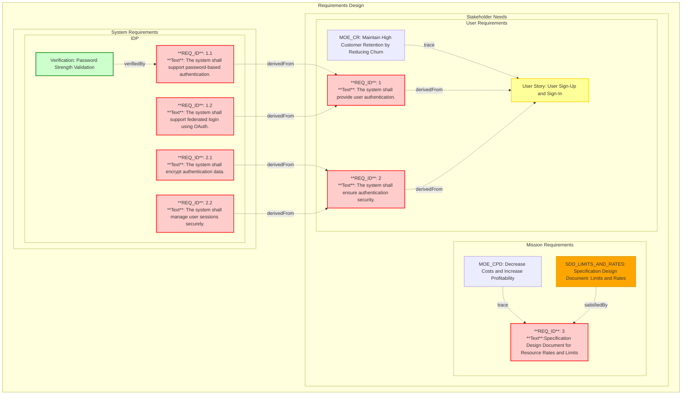

## Conceptual Overview

Reqvire is a tool, framework, and methodology for requirements management. In Reqvire, a **requirement** represents a stakeholder's need, system capability, or constraint that the system must fulfill. Requirements define:

- **What** the system must do
- **How** the system does it (including functional implementation details and non-functional aspects such as performance, security, and quality attributes)

These requirements serve as the foundation for system design, development, and verification.

Reqvire enforces a **consistent structure** for organizing and presenting requirements across the project. However, it does **not impose a specific syntax** for how the content of requirements is written. This provides flexibility for teams to tailor requirement expressions based on project context.

The use of structured syntaxes like **EARS (Easy Approach to Requirements Syntax)** is encouraged to enhance clarity and consistency but is **not mandatory**.

For detailed specifications on document structure and formatting, refer to: [Specifications](https://github.com/reqvire-org/reqvire/blob/main/specifications/SpecificationsRequirements.md).


## Requirement Types and Classification

Reqvire organizes requirements into **two main categories**:

- **User Requirements**  
  (includes Stakeholder Needs, Mission Requirements, User Stories, and other WHAT-focused requirements)

- **System Requirements**  
  (detailed technical and functional specifications describing HOW the system will fulfill user needs)

This structure supports a **progressive refinement** approach, ensuring traceability from high-level stakeholder expectations down to technical implementation.

---

## User Requirements

**User requirements** represent **stakeholder needs**, **mission objectives**, **user expectations**, and **WHAT-focused requirements**. These describe *what* the system must do from an external point of view, without specifying technical implementation details.

User requirements include:

- **Stakeholder needs**: High-level expressions of expectations from users, customers, operators, and regulatory bodies.
- **Mission requirements**: Enterprise-level objectives the system must support.
- **User stories**: Informal narratives that describe system interactions or functionalities from a user's perspective.
- **WHAT-focused requirements**: Formalized requirements that define system capabilities, behaviors, or constraints without dictating the solution approach.

User requirements serve as the **foundation for system design**, ensuring that all stakeholder concerns and operational goals are captured before technical development begins.


## System Requirements

**System requirements** specify **HOW** the system will fulfill the user and mission requirements. They define detailed **technical** and **functional** specifications, covering:

- System behaviors
- Performance criteria
- Interfaces and data flows
- Design and regulatory constraints

System requirements are derived from user requirements and are structured to map directly to **subsystems** or **components** of the overall system, ensuring **modularity** and **traceability**.

## Requirement Containment

Reqvire manages **requirement containment** through its **file and folder structure** rather than explicit containment relationships. This approach provides a natural and intuitive way to organize and group related requirements.

### Files and Folders as Containers

In Reqvire, requirements are organized hierarchically using:

- **Folders**: Directory structure represents major system areas, subsystems, or requirement categories.
- **Files**: Markdown files serve as containers for requirements, typically grouping related requirements within a folder.

This file-and-folder based containment approach offers several advantages:

- **Natural hierarchy**: The directory structure directly reflects the containment relationships.
- **Simplified management**: No need to maintain explicit containment links between requirements.
- **Clear organization**: The physical location of a requirement in the documentation hierarchy shows its containment.
- **Flexible grouping**: Requirements can be easily reorganized by moving them between files or folders.

### Example Structure

```
project/
├── Requirements.md              # Top-level user requirements
│   ├── REQ_AUTH
│   └── REQ_SECURITY
└── Authentication/
    ├── PasswordAuth.md          # Password authentication requirements
    │   └── REQ_PASSWORD
    └── OAuthAuth.md             # OAuth authentication requirements
        └── REQ_OAUTH
```

In this example:
- Top-level `Requirements.md` file contains high-level user requirements
- `Authentication/` folder contains detailed system requirements for the authentication subsystem
- Each file groups related requirements
- The `derivedFrom` relationship traces technical requirements back to user requirements
- Organization follows **architectural decomposition** by subsystem/component rather than by artifact type

## Diagram summary


The diagram below demonstrates how requirements, their relationships, and hierarchical structures are organized within the **Reqvire methodology**. 
It showcases the connection between stakeholder needs, user requirements, mission requirements, system requirements, and their links to verifications, specification documents, and other system elements.



## Visual Representation

Reqvire automatically generates visual representations of requirements and their relationships using Mermaid diagrams. For more information on diagrams, see the [User Guide](./user_guide.md#diagrams) and [Specifications](https://github.com/reqvire-org/reqvire/blob/main/specifications/SpecificationsRequirements.md).


