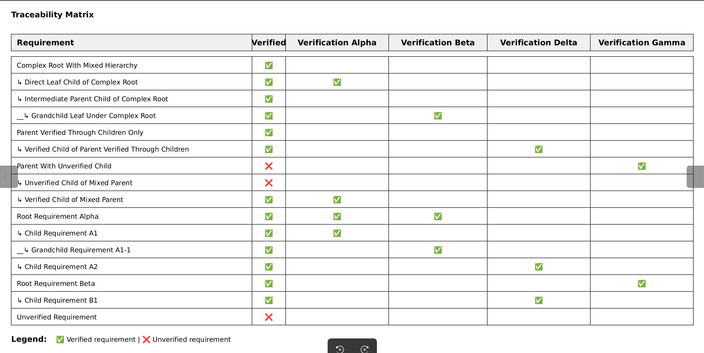

This user guide provides detailed instructions on how to install and use Reqvire effectively.

## Table of Contents

- [Installation](#installation)
- [Basic Commands](#basic-commands)
- [File Exclusion Patterns](#file-exclusion-patterns)
- [Working with Requirements](#working-with-requirements)
- [Element Manipulation](#element-manipulation)
- [Validation](#validation)
- [Formatting](#formatting)
- [Linting](#linting)
- [Generating Documentation](#generating-documentation)
- [Traceability](#traceability)
- [Search and Filtering](#search-and-filtering)
- [Model Commands](#model-commands)
- [Change Impact Report](#change-impact-report)
- [Diagrams](#diagrams)
- [GitHub Integration](#github-integration)
  - [GitHub Actions](#github-actions)
  - [GitHub Issue Comment Commands](#github-issue-comment-commands)

---

## Installation

### Quick Install

Install Reqvire using the installation script:

```bash
curl -fsSL https://raw.githubusercontent.com/reqvire-org/reqvire/main/scripts/install.sh | bash
```

This will download and install the latest version of Reqvire for your platform.

### Installing from Source

If you prefer to build from source, you'll need Rust installed:

```bash
git clone https://github.com/reqvire-org/reqvire.git
cd reqvire
cargo build --release
```

The binary will be available at `target/release/reqvire`.

### Verify Installation

Check that Reqvire is installed correctly:

```bash
reqvire --version
```

---

## Basic Commands

Reqvire offers several core commands for managing your requirements:

### Help

View the available commands and options:

```bash
reqvire --help
```

### Version

Display the current version:

```bash
reqvire --version
```

## File Exclusion Patterns

Reqvire automatically excludes files and directories from structured markdown processing based on ignore patterns defined in:

1. **`.gitignore`** - If your project is a git repository, reqvire reads the `.gitignore` file at the repository root
2. **`.reqvireignore`** - A reqvire-specific ignore file using the same pattern syntax as `.gitignore`
3. **Reserved filenames** - Certain common repository documentation files are always excluded from structured markdown processing

Both ignore files use standard gitignore pattern syntax to exclude files from being parsed as structured markdown (requirements/verifications). However, they differ in an important way:

- **`.gitignore`**: Files matching these patterns are **completely excluded** - they cannot be parsed as structured markdown AND cannot be referenced in file relations to elements
- **`.reqvireignore`**: Files matching these patterns are excluded from structured markdown parsing BUT **can still be referenced** in file relations to elements (useful for design documents, diagrams, or other supporting files that you want to link to but not parse)

### Reserved Filenames

The following filenames are considered reserved and are always excluded from structured markdown processing, as they are typically used for general repository documentation or AI assistant context:

- `README.md`
- `CHANGELOG.md`, `CHANGES.md`
- `CONTRIBUTING.md`
- `LICENSE.md`
- `CODE_OF_CONDUCT.md`
- `SECURITY.md`
- `AUTHORS.md`
- `ROADMAP.md`
- `CLAUDE.md`
- `AGENT.md`
- `AI.md`
- `PROMPT.md`
- `INSTRUCTIONS.md`
- `CONTEXT.md`
- `CURSOR.md`
- `COPILOT.md`

**Example `.reqvireignore`:**
```
# Exclude use case documents
Usecases.md

# Exclude logical and physical design documents
Logical*.md
Physical*.md

# Exclude TODO lists
TODO.md

# Exclude entire directories
tests/**
src/**
```

## Working with Requirements

Reqvire is designed to work with a structured requirements hierarchy in Markdown files. Requirements are organized using **folders, files, and sections for logical containment** - representing subsystems, features, or functional areas.

### Folder Structure

Reqvire supports flexible organization based on **architectural decomposition** - structuring by subsystem/component rather than by artifact type. Requirements can be organized separately from implementation or co-located with code.

**Example 1: Requirements separate from implementation**

```
project/
├── Requirements.md
├── Authentication/
│   └── Requirements.md           # Authentication subsystem requirements
├── Storage/
│   └── Requirements.md           # Storage subsystem requirements
├── API/
│   └── Requirements.md           # API subsystem requirements
└── src/
    ├── auth.rs
    ├── storage.rs
    └── api.rs
```

**Example 2: Requirements co-located with implementation**

```
project/
├── Requirements.md
└── src/
    ├── authentication/
    │   ├── Requirements.md       # Authentication subsystem requirements
    │   └── auth.rs
    ├── storage/
    │   ├── Requirements.md       # Storage subsystem requirements
    │   └── storage.rs
    └── api/
        ├── Requirements.md       # API subsystem requirements
        └── api.rs
```

Both approaches organize by architectural decomposition. The co-location approach provides additional benefits for developers and AI coding assistants by placing requirements directly alongside the code they describe.

### Model Structure

Markdown files contain **requirements** and **verification elements** that together form the complete model structure. These elements are connected through:

- **Containment**: The folder, file, and section hierarchy provides the containment structure
- **Relations**: Elements are wired together using relations such as:
  - `derivedFrom` - hierarchical relation showing how detailed requirements derive from higher-level ones
  - `verifies` - linking verifications to requirements they verify
  - `trace` - soft relations for traceability between elements

The combination of containment structure and explicit relations creates the full requirements model.

### Requirement Hierarchy Levels

Requirements are organized in hierarchical levels within the markdown structure:

- **Level 1 requirements** are root-level requirements that don't have parent relations. These are typically found at the top level of your main requirements file.
- **Level 2 requirements** (children of level 1) are usually **user requirements** - high-level stakeholder needs and system objectives.
- **Deeper levels** typically contain **system requirements** - detailed technical specifications that derive from and implement the user requirements above them.

This hierarchy naturally reflects the progressive refinement from high-level user needs down to detailed technical implementation.

### Requirements and general Markdown files format

Read specifications in [SpecificationsRequirements.md](https://github.com/reqvire-org/reqvire/blob/main/specifications/SpecificationsRequirements.md)

## Element Manipulation

Reqvire provides commands to add, move, and remove elements directly from the command line. These operations maintain model consistency by validating relations and updating parent files automatically.

### Add Element

Add a new element to your model from Markdown content:

```bash
# Add element using heredoc
reqvire add --to-file "specifications/Requirements.md" --to-section "System Requirements" <<'EOF'
### New Security Requirement

The system SHALL enforce authentication for all API endpoints.

#### Metadata
  * type: system-requirement

#### Relations
  * derivedFrom: Requirements.md#user-authentication
EOF

# Add from file using pipe
cat element.md | reqvire add specifications/Requirements.md "System Requirements"

# Add from file using input redirection
reqvire add specifications/Requirements.md "System Requirements" < element.md

# Add inline using echo and pipe
echo "### My Requirement..." | reqvire add specifications/Requirements.md "Features"
```

The element will be inserted at the end of the specified section. You can also specify an index (0-based):

```bash
# Insert at position 0 (beginning) using pipe
cat element.md | reqvire add specifications/Requirements.md "System Requirements" 0

# Insert at position 2 using heredoc
reqvire add specifications/Requirements.md "Features" 2 <<'EOF'
### My New Requirement
Content here...
EOF

# Insert at position using input redirection
reqvire add specifications/Requirements.md "Security" 1 < element.md
```

#### Preview Changes

Use `--dry-run` to preview the operation without applying changes:

```bash
reqvire add --to-file "specs/Reqs.md" --to-section "Features" --dry-run < element.md
```

#### JSON Output

Get structured output for programmatic processing:

```bash
reqvire add --to-file "specs/Reqs.md" --to-section "Features" --json < element.md
```

### Remove Element

Remove an element by its identifier:

```bash
reqvire rm "specifications/Requirements.md#security-requirement"
```

This command:
- Removes the element from its parent file
- Validates that no other elements have relations pointing to it
- Fails if the element is referenced by other elements (maintaining model integrity)

#### Preview Removal

Use `--dry-run` to see what would be removed:

```bash
reqvire rm "specifications/Requirements.md#old-requirement" --dry-run
```

### Move Element

Move an element to a different location:

```bash
# Move to different section in same file
reqvire mv "specs/Reqs.md#auth-requirement" --to-section "Security"

# Move to different file
reqvire mv "specs/Reqs.md#auth-requirement" \
           --to-file "specs/Security.md" \
           --to-section "Authentication"

# Move to specific position
reqvire mv "specs/Reqs.md#auth-requirement" \
           --to-section "Security" \
           --index 0
```

The move operation:
- Updates the element's identifier to reflect new location
- Updates all relations pointing to the moved element
- Maintains model consistency automatically

#### Preview Move

Use `--dry-run` to preview the operation:

```bash
reqvire mv "specs/Reqs.md#auth-req" --to-section "Security" --dry-run
```

## Validation

Any functional reqvire command that needs to parse model will as a first step perform model validation and report any errors found.
Errors must be fixed before command can execute.

## Formatting

Formatting helps maintain consistent formatting and style.

### Check Formatting (Dry-Run)

Preview formatting issues without applying changes (safe default):

```bash
reqvire format
```

This shows what would be changed but doesn't apply any fixes.

### Apply Fixes

Apply automatic fixes to formatting issues:

```bash
reqvire format --fix
```

## Linting

The lint command analyzes model quality and detects issues in requirements relations, such as redundant verify relations and potentially redundant hierarchical relations.

### Analyze All Issues

Run lint to detect all model quality issues:

```bash
reqvire lint
```

This analyzes the model and reports all detected issues.

### Filter by Issue Type

```bash
# Show only auto-fixable issues
reqvire lint --fixable

# Show only issues requiring manual review
reqvire lint --auditable
```

### Apply Automatic Fixes

Apply automatic fixes for auto-fixable issues:

```bash
reqvire lint --fix
```

**Note:** Only auto-fixable issues (like redundant verify or redundant direct chain hierarchical relations) will be fixed. Issues marked as requiring manual review (auditable) must be addressed manually.

### JSON Output

Output results in JSON format for integration with other tools:

```bash
reqvire lint --json
```

## Traceability

Track relationships between requirements and verifications using traceability features.

### Generate Verification Traces

```bash
reqvire traces
```

This generates upward trace trees from verifications to root requirements, showing how verifications link to requirements and their parent chains. It also identifies redundant verify relations - cases where the same verification verifies both a leaf requirement and its parent, which indicates the model is not clean. Output is in Markdown format with Mermaid diagrams by default.

#### Output Format Options

```bash
# Generate verification traces in Markdown format with Mermaid diagrams (default)
reqvire traces

# Generate verification traces in JSON format
reqvire traces --json
```

#### Filtering Options

You can filter the verification traces using various criteria:

```bash
# Filter by specific verification ID
reqvire traces --filter-id="test-auth-001"

# Filter by verification name pattern (regex)
reqvire traces --filter-name="Authentication.*"

# Filter by verification type
reqvire traces --filter-type="test-verification"

# Combine multiple filters (AND logic)
reqvire traces --filter-type="test-verification" --filter-name="Login.*" --json
```

Supported verification types: `test-verification`, `analysis-verification`, `inspection-verification`, `demonstration-verification`

#### Relative Link Generation

By default, verification traces generate links relative to the directory where reqvire was executed. You can specify a different base folder for relative links:

```bash
# Generate traces with links relative to a specific folder
reqvire traces --from-folder="docs/specs"

# This makes generated links relative to docs/specs instead of the current directory,
# useful when the output will be placed in a different location
```

#### GitHub Blob Links

```bash
# Generate traces with GitHub blob links (useful for viewing from GitHub)
reqvire traces --links-with-blobs
```

By default, traces use relative links in Mermaid diagrams. Use `--links-with-blobs` to generate diagrams with GitHub blob URLs, which makes clickable links work properly when viewing trace diagrams directly in the GitHub web interface.

### Generate Verification Matrix

```bash
reqvire matrix
```

This generates a traceability matrix showing verification coverage across all requirements.

#### Output Format Options

```bash
# Generate verification matrix in SVG format
reqvire matrix --svg > matrix.svg

# Generate verification matrix in JSON format
reqvire matrix --json
```

The matrix implements the **verification roll-up strategy** - a requirement at any level is marked as verified if ALL its child requirements are verified, with verification status rolling up from leaf requirements through the entire parent chain to the root.

#### Example Verification Matrix



*Example traceability matrix showing verification coverage and roll-up strategy. Requirements are color-coded by verification status, with verification rolling up from leaf requirements to parent requirements.*

## Search and Filtering

The `search` command provides powerful filtering and querying capabilities to explore your requirements model. It supports comprehensive filtering with over 10 filter types that can be combined using AND logic.

### Basic Search

```bash
# Search all elements (default text output)
reqvire search

# Search with JSON output
reqvire search --json

# Abbreviated output (one-line per element)
reqvire search --short
```

### Filtering by Metadata

Filter elements by their metadata properties:

```bash
# Filter by element type
reqvire search --filter-type="user-requirement"
reqvire search --filter-type="system-requirement"
reqvire search --filter-type="test-verification"

# Filter by file path (glob pattern)
reqvire search --filter-file="specifications/**/*.md"

# Filter by section name (glob pattern)
reqvire search --filter-section="System*"
reqvire search --filter-section="*Security*"

# Filter by element name (regex)
reqvire search --filter-name=".*authentication.*"
```

### Filtering by Content

Filter elements based on their text content:

```bash
# Filter by element content
reqvire search --filter-content="SHALL.*authenticate"

# Filter by parent section content
reqvire search --filter-section-content="security requirements"

# Filter by parent file frontmatter content
reqvire search --filter-page-content="architecture"
```

### Filtering by Relations

Filter elements based on their relations to other elements:

```bash
# Find elements that have ALL specified relations
reqvire search --have-relations="verifiedBy,satisfiedBy"

# Find elements that do NOT have ALL specified relations
reqvire search --not-have-relations="verifiedBy"

# Find unverified requirements
reqvire search --filter-type="requirement" --not-have-relations="verifiedBy"

# Find unsatisfied verifications
reqvire search --filter-type="test-verification" --not-have-relations="satisfiedBy"
```

### Combining Filters

All filters use AND logic - elements must match ALL specified criteria:

```bash
# Find unverified user requirements in System section
reqvire search --filter-type="user-requirement" \
               --filter-section="System*" \
               --not-have-relations="verifiedBy"

# Find security requirements mentioning encryption
reqvire search --filter-section="*Security*" \
               --filter-content="encryption" \
               --filter-type="system-requirement"

# Complex query with JSON output
reqvire search --filter-file="specifications/*.md" \
               --filter-type="user-requirement" \
               --have-relations="verifiedBy" \
               --filter-content="SHALL" \
               --json
```

### Output Modes

```bash
# Full text output with all details
reqvire search --filter-section="Security"

# Abbreviated text output (one line per element)
reqvire search --short --filter-section="Security"

# JSON output for programmatic processing
reqvire search --json --filter-type="requirement"

# Abbreviated JSON (omits content and verbose fields)
reqvire search --json --short
```

## Model Commands

The `model` command generates a model-centric view showing requirements and verifications with their nested relations as a hierarchical tree structure.

### Generate Model-Centric Structure

Generate a complete model-centric structure starting from root requirements:

```bash
reqvire model
```

This generates a hierarchical structure showing:
- Root requirements (level 1)
- Their nested child requirements and relations
- Complete forward relation chains (derive, satisfiedBy, verifiedBy, trace)
- Mermaid diagrams for each element showing its relations

Each element in the output includes a Mermaid diagram visualizing its forward relations to other elements.

### Filter by Element Name

Generate a filtered model starting from a specific element by name:

```bash
# Show model structure starting from named element
reqvire model --from "User Authentication"

# Show nested structure for specific feature
reqvire model --from "Data Storage System"
```

This includes only the specified element and elements reachable by following forward relations (derive, satisfiedBy, verifiedBy, trace) from it.

### Output Format Options

```bash
# Generate model in text format with Mermaid diagrams (default)
reqvire model

# Generate filtered text output from specific element
reqvire model --from "Security Requirements"

# Generate complete model structure in JSON format (nested)
reqvire model --json

# Generate filtered JSON starting from specific element
reqvire model --from "API Layer" --json
```

The JSON output contains the nested model structure with elements containing their forward-related child elements, making it suitable for programmatic analysis and integration with other tools.

## Change Impact Report

Generates change impact report comparing current git HEAD with a previous commit.

### Generate Change Impact Report

```bash
reqvire change-impact
```

This generates a report showing how changes affect related requirements. By default, it compares with HEAD~1 (the previous commit).

#### Options

```bash
# Use default comparison with HEAD~1
reqvire change-impact

# Compare with a specific commit (hash or reference)
reqvire change-impact --git-commit=a1b2c3d4

# Output in JSON format for integration with other tools
reqvire change-impact --json
```

## Generating Documentation

Reqvire can export your model to browsable HTML documentation with complete traceability.

### Export to HTML

```bash
reqvire export --output output_folder
```

This creates HTML files with navigation, properly formatted requirements, interactive diagrams, verification traces, and coverage reports.

The HTML export includes:
- **Interactive Diagrams**: All Mermaid diagrams include click handlers that navigate to element definitions
- **Color-Coded Elements**: Requirements and verifications are color-coded by type for easy identification
- **Pan and Zoom**: Diagrams support pan/zoom functionality with auto-centering
- **Model-Centric View**: Nested hierarchical structure showing forward relations
- **Complete Traceability**: Verification traces, coverage reports, and traceability matrices
- **Navigation**: Index page with links to all documentation sections

### Serve Documentation Locally

For local development and preview, use the serve command to start a local HTTP server:

```bash
reqvire serve
```

This command starts a local server serving your documentation. It's particularly useful for local development and for integrating with AI assistants via Playwright or Puppeteer MCP servers, giving them visual access to your documentation.

#### Command Options

```bash
# Start server on default host and port (localhost:8080)
reqvire serve

# Specify custom host and port
reqvire serve --host 0.0.0.0 --port 3000
```

**Options:**
- `--host <HOST>` - Bind address (default: `localhost`)
- `--port <PORT>` - Server port (default: `8080`)

The server will display the URL. Press `Ctrl-C` to stop the server.

## Diagrams

Reqvire can automatically generate diagrams from your requirements model.

### Generate Diagrams

```bash
reqvire generate-diagrams
```

This creates Mermaid diagrams within your requirements files.

#### Options

```bash
# Generate diagrams with GitHub blob links (useful for viewing from GitHub)
reqvire generate-diagrams --links-with-blobs
```

By default, diagrams use relative links. Use `--links-with-blobs` to generate diagrams with GitHub blob URLs, which makes clickable links work properly when viewing diagrams directly in the GitHub web interface.

### Remove Diagrams

```bash
reqvire remove-diagrams
```

This removes Mermaid diagrams within your requirements files. It is suggested to remove diagrams before using AI tools to reason about model to reduce context length.


## GitHub Integration

Reqvire integrates with GitHub workflows to automate various tasks and provide additional functionality during pull requests and regular development.

### GitHub Actions

Reqvire includes several GitHub Actions workflows that can be used in your repository. You can easily install Reqvire in any GitHub Actions workflow using this oneliner:

```yaml
- name: Install Reqvire
  run: curl -fsSL https://raw.githubusercontent.com/reqvire-org/reqvire/main/scripts/install.sh | bash
```

#### PR Validation

The PR validation workflow runs automatically on every pull request to validate your requirements model:

```yaml
name: Validate Requirements on PR

on:
  pull_request:
    branches:
      - main
    types: [opened, synchronize, reopened]  # Trigger on PR creation, updates, and reopening


jobs:
  validate:
    name: Validate Requirements
    runs-on: ubuntu-latest

    steps:
      - name: Checkout Repository
        uses: actions/checkout@v4
        
      - name: Install Reqvire
        run: curl -fsSL https://raw.githubusercontent.com/reqvire-org/reqvire/main/scripts/install.sh | bash
        
      - name: Validate requirements and generate report
        id: validate
        continue-on-error: true
        run: |
          mkdir -p reports
          reqvire validate | tee reports/validation_report.txt

      - name: Upload Validation Report if validation failed
        if: failure()
        uses: actions/upload-artifact@v4
        with:
          name: reqvire-validation-report
          path: reports/validation_report.txt          
```

#### Automated Diagram Generation

This workflow automatically generates and commits updated diagrams when pull requests are merged to the main branch:

```yaml
name: Generate Diagrams and Traces SVG on PR Merge

on:
  pull_request:
    types: [closed]
    branches:
      - main

jobs:
  generate-diagrams:
    if: github.event.pull_request.merged == true
    name: Generate and Commit Diagrams
    runs-on: ubuntu-latest
    
    permissions:
      contents: write  # Required to commit to the repository
    
    steps:
      - name: Checkout Repository
        uses: actions/checkout@v4
        with:
          ref: main  # Checkout the default branch (change if needed)
          fetch-depth: 0  # Get full history for proper Git operations
      
      
      - name: Install Reqvire
        run: curl -fsSL https://raw.githubusercontent.com/reqvire-org/reqvire/main/scripts/install.sh | bash
            
      - name: Configure Git
        run: |
          git config --global user.name "GitHub Action"
          git config --global user.email "actions@github.com"
      
      - name: Generate Diagrams
        run: |
          reqvire generate-diagrams
      
      - name: Generate verification matrix svg
        run: |
          reqvire matrix --svg > specifications/matrix.svg
                
      - name: Check for Changes
        id: check_changes
        run: |
          if [[ -n "$(git status --porcelain)" ]]; then
            echo "HAS_CHANGES=true" >> $GITHUB_ENV
          else
            echo "HAS_CHANGES=false" >> $GITHUB_ENV
          fi
      
      - name: Commit and Push Changes
        if: env.HAS_CHANGES == 'true'
        run: |
          git add -A
          git commit -m "Auto-generate diagrams after PR merge to main"
          git push origin main # Change if needed
```

### GitHub Issue Comment Commands

Reqvire supports command-driven operations through GitHub issue comments. These commands can be used in pull request discussions to trigger specific Reqvire operations.

#### Available Commands

| Command | Description |
|---------|-------------|
| `/reqvire impact` | Triggers change impact analysis |

#### Setup Example

Here's how to set up the comment commands in your workflow:

```yaml
name: Reqvire PR Commands

on:
  issue_comment:
    types: [created]

jobs:
  run-reqvire:
    if: |
      github.event.issue.pull_request != null &&
      (
        contains(github.event.comment.body, '/reqvire impact') ||
        contains(github.event.comment.body, '/reqvire traces')
      )
    runs-on: ubuntu-latest
       
    permissions:
      pull-requests: write
      issues: write
      contents: read
      
    
    steps:
      - name: Checkout PR Branch
        uses: actions/checkout@v4
        with:
          fetch-depth: 0
      
      - name: React to trigger comment with
        uses: peter-evans/create-or-update-comment@v3
        with:
          token: ${{ secrets.GITHUB_TOKEN }}
          comment-id: ${{ github.event.comment.id }}
          reactions: '+1'
          
      - name: Checkout PR source branch
        uses: actions/checkout@v4
                    
      - name: Get PR Head Ref using gh
        id: get_pr_head
        env:
          GH_TOKEN: ${{ secrets.GITHUB_TOKEN }}
        run: |
          HEAD_REF=$(gh pr view ${{ github.event.issue.number }} --json headRefName --jq '.headRefName')
          echo "Using PR head ref: $HEAD_REF"
          echo "HEAD_REF=$HEAD_REF" >> $GITHUB_ENV
              
      - name: Checkout PR source branch
        uses: actions/checkout@v4
        with:
          ref: ${{ env.HEAD_REF }}
          fetch-depth: 0  # needed for full commit history
              
      - name: Get Base Branch from PR using gh
        id: get_pr_base
        env:
          GH_TOKEN: ${{ secrets.GITHUB_TOKEN }}
        run: |
          BASE_BRANCH=$(gh pr view ${{ github.event.issue.number }} --json baseRefName --jq '.baseRefName')
          echo "Using base branch: $BASE_BRANCH"
          echo "BASE_BRANCH=$BASE_BRANCH" >> $GITHUB_ENV
          
      - name: Compute merge base commit
        id: base_commit
        run: |
          git fetch origin "$BASE_BRANCH"
          BASE_COMMIT=$(git merge-base origin/"$BASE_BRANCH" HEAD)
          echo "Base commit: $BASE_COMMIT"
          echo "BASE_COMMIT=$BASE_COMMIT" >> $GITHUB_ENV

      - name: Ensure PR branch remains checked out
        run: |
          git checkout ${{ github.event.issue.pull_request.head.ref }}
         
                          
      - name: Install Reqvire
        run: curl -fsSL https://raw.githubusercontent.com/reqvire-org/reqvire/main/scripts/install.sh | bash
      
      - name: Run Reqvire Impact (if triggered)
        if: contains(github.event.comment.body, '/reqvire impact')
        id: run_impact
        run: |
          OUTPUT=$(reqvire change-impact --git-commit "$BASE_COMMIT" 2>&1 || echo "⚠️ reqvire impact failed.")
          echo "REQVIRE_OUTPUT<<EOF" >> $GITHUB_ENV
          echo "$OUTPUT" >> $GITHUB_ENV
          echo "EOF" >> $GITHUB_ENV

      - name: Run Reqvire Verification Traces (if triggered)
        if: contains(github.event.comment.body, '/reqvire traces')
        id: run_traces
        run: |
          OUTPUT=$(reqvire traces || echo "⚠️ reqvire traces failed.")
          echo "REQVIRE_OUTPUT<<EOF" >> $GITHUB_ENV
          echo "$OUTPUT" >> $GITHUB_ENV
          echo "EOF" >> $GITHUB_ENV
          
      - name: Comment on PR with result
        uses: peter-evans/create-or-update-comment@v3
        with:
          issue-number: ${{ github.event.issue.number }}
          body: |
            ${{ env.REQVIRE_OUTPUT }}            
```

These commands provide valuable insights during the pull request review process, helping reviewers understand the impact of changes on the requirements model.

